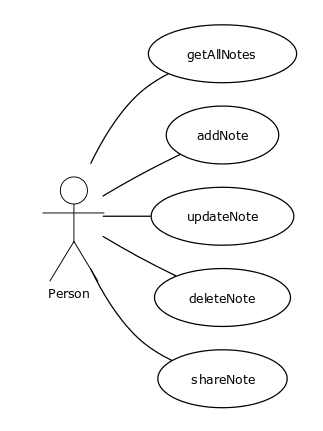
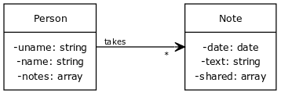
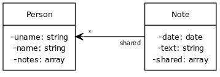

# Adatbázis használat gyakorlatban

_**Absztrakt:** A cél egy egyszerű, kokrét ipar ági ismereteket nem igénylő, mindenki számára könnyen megérthető projekt késztése. A projekt követi a cégeknél használatos általánosan elterjedt architektúrát. Egyetemista diákok számára szemléltetésként készült. Azt szeretné bemutatni, hogyan épül fel egy valós projekt backend-je és hogyan csatlakozik az adatbázishoz. Hogyan lesznek a táblák létrehozva az adatbázisban? Hogy lesznek a projekt élettartama során módosítva? Hogyan kerül tesztadat az adatbázisba? Hogy használja az applikáció az adatbázsit?_

## Feladat 

Készítsünk egy alkalmazást, amelyben a felhasználók jegyzeteket tudnak tárolni illetve megosztani egymással. Adottak a következő *use case*-ek.



### Use Case leírás

**Take note**
> Létrehoz egy jegyzetet és hozzácsatolja a létrehozó személyéhez. Egy jegyzetsem létezhet létrehozó nélkül.
>
> *Endpoint:* `PUT http://localhost:3000/takeNote?user={uname}`
> ```json
> { "text":"This is the body of the note." }
> ```

### Osztálydiagram

;

;

## Elméleti bevezető
Általánosságban elmondható hogy az aplikációt három nagyobb egységbe tagoljuk. 
- Grafikus interface (amit **frontend**-nek vagy **UI**-nak nevezünk). 
- Backend, ami egy webszerveren fut és általában a **business logikát** tartalmazza. A business logika nem más mint minden, amit az adatokkal teszünk, döntések, számítások, átalakítások.
- Az adatbázis is egy különálló egysége az alkalmazásnak és az adatok illetve az alkalmazás állapotának tárolására szolgál.

### Web Applikáció

```
          *------*   - HTML, CSS
          |  UI  |   - JavaScript
          *------*   - React
              ^      - Angular
              |
      API <-- |
              |
              v
        *-----------*
        |  Backend  | - Java
        *-----------*
              ^
              |
              |
              |
              v
          *------*    - MySql 
          |  DB  |    - Oracle
          *------*    - Db2
```

Ez a három egység azért bír jelentőséggel, mert ezek egymástól független egységek. Bármelyiket le lehet cserélni közülük anélkül, hogy a másik kettőn módosítanánk.

## Fejlesztői környezet

- [OpenJDK-17.0.2](https://download.java.net/java/GA/jdk17.0.2/dfd4a8d0985749f896bed50d7138ee7f/8/GPL/openjdk-17.0.2_windows-x64_bin.zip) - Környezeti változók: JAVA_HOME, PATH
- [Maven](https://dlcdn.apache.org/maven/maven-3/3.8.4/binaries/apache-maven-3.8.4-bin.zip) - Környezeti változók: MAVEN_HOME, PATH
- [Spring Tool](https://spring.io/tools)
- [Eclipse](https://www.eclipse.org/downloads/download.php?file=/oomph/epp/2021-12/R/eclipse-inst-jre-win64.exe&mirror_id=1) or [Visual Studio Code](https://code.visualstudio.com/Download) - Eclipse IDE for Enterprise Java and Web Developers
- [Git](https://git-scm.com/download/win)
- [Postman](https://www.postman.com/downloads/)
- [Docker](https://www.docker.com/products/docker-desktop)

## Technológiák

### Spring

[start.spring.io](https://start.spring.io/)

- Project: *Maven Project*
- Spring Boot: *2.6.3*
- Project Metadata:
  + Group: *example.project*
  + Artifact:*backend*
  + Name: *backend-database-example*
  + Description: *Real life example of backend application structure using database*
  + Package name: *example.project.backend*
- Packaging: *jar*
- Java: *17*
- Dependencies:
  + *Spring Web*
  + *Lombok*

#### Maven

[Maven Archetypes](https://maven.apache.org/guides/introduction/introduction-to-archetypes.html)

```
mvn archetype:generate -DgroupId=test -DartifactId=demo -D archetypeArtifactId=maven-archetype-quickstart -DinteractiveMode=false
```

**.m2** könyvtár: A *maven* ebbe a könyvtárba tölti le és tárolja lokálisan a *java* könyvtárakat.

#### Annotációk

- **@Component** - Általános célu komponenes
  + **@RestController** - Rest Api (Átirányítja a forgalmat)
  + **@Service** - Business logika
  + **@Repository** - Adathozzáférési réteg 

#### Folyamat

```

                                                                                               --- 
     -----          * --------------- *     * --------------- *     * --------------- *      /     \
   /       \        |                 |     |                 |     |                 |     |\     /|
  |   user  | ----> | @RestController | --> |    @Servive     | --> |   @Repository   | --> |  ---  |
   \       /        |                 |     |                 |     |                 |     |   DB  |
     -----          * --------------- *     * --------------- *     * --------------- *      \     /
                                                                                               --- 

```

#### Élettartam

- Singleton
- Prototype
- Request
- Session
- Global Session

### REST API

A **REST** az egy standard API-ok készítéséhez, amelyik **HTTP** protokollon keresztül működik.

#### HTTP

HTTP Kérés: [http://localhost:8080/login]

- http: protokol
- localhost: IP cím
- 8080: port
- login: API metódus elérése

HTTTP Metódus
- GET, POST, PUT, DELETE, PATCH

HTTP Header
- Fontos infó a lekérdezéssel kapcsolatban (pl. Autentikálás)

Request Body
- A lekérdezéshez tartozó adatok JSON

#### CRUD 

- Create **POST**
- Read **GET**
- Update **PUT**
- Delete **DELETE**
