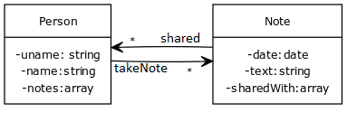
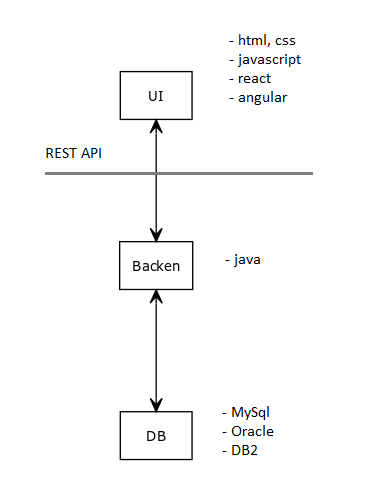
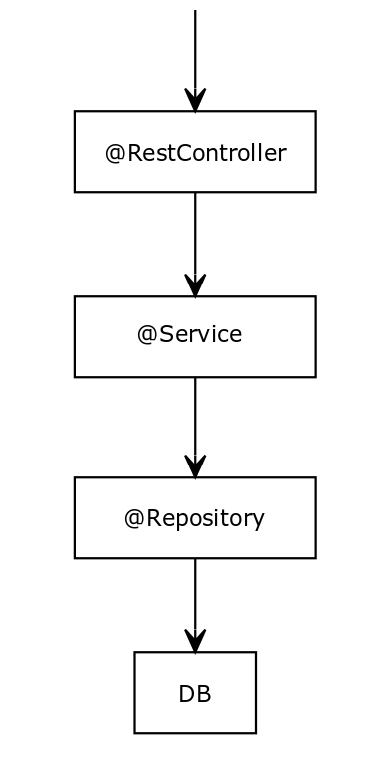
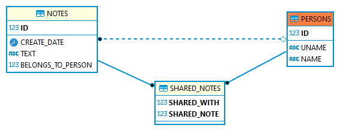

# Adatbázis használat gyakorlatban

_**Absztrakt:** A cél egy egyszerű, konkrét iparági ismereteket nem igénylő, mindenki számára könnyen megérthető projekt késztése. A projekt követi a cégeknél használatos általánosan elterjedt architektúrát. Egyetemista diákok számára szemléltetésként készült. Azt szeretné bemutatni, hogyan épül fel egy valós projekt backend-je és hogyan csatlakozik az adatbázishoz. Hogyan lesznek a táblák létrehozva az adatbázisban? Hogy lesznek a projekt élettartama során módosítva? Hogyan kerül tesztadat az adatbázisba? Hogy használja az applikáció az adatbázsit?_

## Feladat 

Készítsünk egy alkalmazást, amelyben a felhasználók jegyzeteket tudnak tárolni illetve megosztani egymással. Adottak a következő *use case*-ek.


### Use Case 

**getAllNotes**

> Lekérdezi egy személy összes jegyzetét, felhasználó név szerint.
>
> *Endpoint:* `GET http://localhost:8080/person/all/notes/?uname=kdani`
>
> *Response body:*
>
> ```json
> [
>    {
>        "id": 1,
>        "date": "2022-02-10T17:17:26.000+00:00",
>        "text": "Már kevesebb, mint egy hét van hátra az Elite Challenge próbáig. Számomra az elmúlt időszak (hiszen eredetileg április végén lett volna) az erre való felkészülés jegyében telt. Nem is elsősorban a fizikai felkészülés volt fontos a számomra, hanem az a belső út, amelyet végigjártam közben. Még indulás előtt szeretném elmondani a gondolataimat, érzéseimet, megéléseimet minderről - így sokkal érdekesebb lesz az, amit majd utána mondok...",
>        "sharedWith": []
>    },
>    {
>        "id": 2,
>        "date": "2022-02-10T17:17:26.000+00:00",
>        "text": "Pár évvel ezelőtt rátaláltam egy Mágusra.  Aki segített nekem, megerősödnöm,az akkori helyzetemből,energiavesztésemből kimásznom. Úgy éreztem azzal már egyedül nem tudok megbirkózni.",
>        "sharedWith": [
>            {
>                "uname": "pandras"
>            }
>        ]
>    },
>    {
>        "id": 3,
>        "date": "2022-02-10T17:17:26.000+00:00",
>        "text": "Két évvel ezelőtt 2016-ban .Újra megkerestem ,hogy segítsen nekem.  Azt éreztem nem a saját életemet élem, azt is tudtam  hogy kiét. Egy karma oldást , egyéb védelmet ,szigorú házifeladatot kaptam akkor.  Másnap már érezhető is volt a változás.Akkor találkoztam azzal a nagy barna lénnyel.Nem bántott csak figyelt. Egymásnak ütköztünk.Mintha akkor ő nem számított volna arra,hogy éppen kijövök arról a helyről.",
>        "sharedWith": [
>            {
>                "uname": "cshajni"
>            }
>        ]
>    }
> ]
> ```

**addNote**

> Készít egy jegyzetet és hozzárendeli egy személyhez
>
> *Endpoint*: `POST http://localhost:8080/notes/add/note/?uname=kdani`
>
> *Request body*:
> 
> ```json
> {
>     "text": "This is a test note"
> }
> ```
>
> *Response body*: 
>
> ```json
> {
>    "id": 27,
>    "date": "2022-02-21T15:27:08.801+00:00",
>    "text": "This is a test note",
>    "sharedWith": null
> }
> ```

**updateNote**

> Módosítja egy jegyzet szövegét
> 
> *Endpoint*: `PUT http://localhost:8080/notes/update/note` 
> 
> *Request body*: 
> 
> ```json
> {
>    "id": "27",
>    "text": "This is the new text for the test note"
> }
> ```

*Response body*:

> ```json
> {
>    "id": 27,
>    "date": "2022-02-21T15:27:08.000+00:00",
>    "text": "This is the new text for the test note",
>    "sharedWith": []
> }
> ```

**shareNote**

> Megoszt egy jegyzetet egy másik személlyel
>
> *Endpoint*: `PUT http://localhost:8080/notes/share/note/27/?uname=cshajni`
>
> *Response body*:
>
> ```json
> {
>    "id": 27,
>    "date": "2022-02-21T15:27:08.000+00:00",
>    "text": "This is the new text for the test note",
>    "sharedWith": [
>        {
>            "uname": "cshajni"
>        }
>    ]
> }
> ```

**deleteNote**

> Letöröl egy jegyzetet
>
> *Endpoint*: `DELETE http://localhost:8080/notes/remove/note/27`
>
> *Response body*: {}

### Osztálydiagram




## Elméleti bevezető
Általánosságban elmondható hogy az aplikációt három nagyobb egységbe tagoljuk. 
- Grafikus interface (amit **frontend**-nek vagy **UI**-nak nevezünk). 
- Backend, ami egy webszerveren fut és általában a **business logikát** tartalmazza. A business logika nem más mint minden, amit az adatokkal teszünk, döntések, számítások, átalakítások.
- Az adatbázis is egy különálló egysége az alkalmazásnak és az adatok illetve az alkalmazás állapotának tárolására szolgál.

### Web Applikáció



Ez a három egység azért bír jelentőséggel, mert ezek egymástól független egységek. Bármelyiket le lehet cserélni közülük anélkül, hogy a másik kettőn módosítanánk.

## Fejlesztői környezet

- [OpenJDK-17.0.2](https://download.java.net/java/GA/jdk17.0.2/dfd4a8d0985749f896bed50d7138ee7f/8/GPL/openjdk-17.0.2_windows-x64_bin.zip) - Környezeti változók: JAVA_HOME, PATH
- [Maven](https://dlcdn.apache.org/maven/maven-3/3.8.4/binaries/apache-maven-3.8.4-bin.zip) - Környezeti változók: MAVEN_HOME, PATH
- [Spring Tool](https://spring.io/tools)
- [Eclipse](https://www.eclipse.org/downloads/download.php?file=/oomph/epp/2021-12/R/eclipse-inst-jre-win64.exe&mirror_id=1) - Eclipse IDE for Enterprise Java and Web Developers
- [Git](https://git-scm.com/download/win)
- [Postman](https://www.postman.com/downloads/)
- [DBeaver](https://dbeaver.io/download/)

## Technológiák

### Spring

[start.spring.io](https://start.spring.io/)

- Project: *Maven Project*
- Spring Boot: *2.6.3*
- Project Metadata:
  + Group: *example.project*
  + Artifact:*backend*
  + Name: *backend-database-example*
  + Description: *Real life example of backend application structure using database*
  + Package name: *example.project.backend*
- Packaging: *jar*
- Java: *17*
- Dependencies:
  + *Spring Web*
  + *Lombok*

#### Maven

[Maven Archetypes](https://maven.apache.org/guides/introduction/introduction-to-archetypes.html)

```
mvn archetype:generate -DgroupId=test -DartifactId=demo -D archetypeArtifactId=maven-archetype-quickstart -DinteractiveMode=false
```

**.m2** könyvtár: A *maven* ebbe a könyvtárba tölti le és tárolja lokálisan a *java* könyvtárakat.

#### Annotációk

- **@Component** - Általános célu komponenes
  + **@RestController** - Rest Api (Átirányítja a forgalmat)
  + **@Service** - Business logika
  + **@Repository** - Adathozzáférési réteg 

#### Folyamat



#### Élettartam

- Singleton
- Prototype
- Request
- Session
- Global Session

### REST API

A **REST** az egy standard API-ok készítéséhez, amelyik **HTTP** protokollon keresztül működik.

#### HTTP

HTTP Kérés: [http://localhost:8080/login]

- http: protokol
- localhost: IP cím
- 8080: port
- login: API metódus elérése

HTTTP Metódus
- GET, POST, PUT, DELETE, PATCH

HTTP Header
- Fontos infó a lekérdezéssel kapcsolatban (pl. Autentikálás)

Request Body
- A lekérdezéshez tartozó adatok JSON

#### CRUD 

- Create **POST**
- Read **GET**
- Update **PUT**
- Delete **DELETE**

## Adatbázis

**pom.xml**

```xml
...
	<dependencies>
		...
		<dependency>
			<groupId>com.oracle.database.jdbc</groupId>
			<artifactId>ojdbc8</artifactId>
			<scope>runtime</scope>
		</dependency>
		<dependency>
			<groupId>org.springframework.boot</groupId>
			<artifactId>spring-boot-starter-data-jpa</artifactId>
		</dependency>
	</dependencies>
...
```

### Tables


